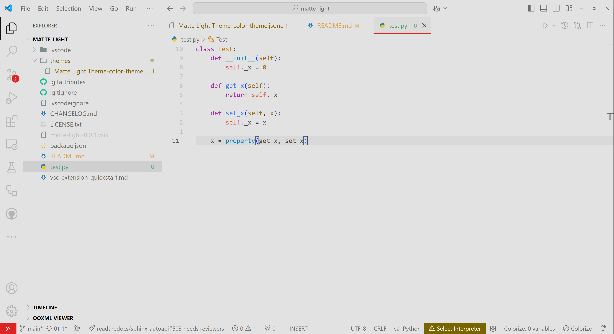
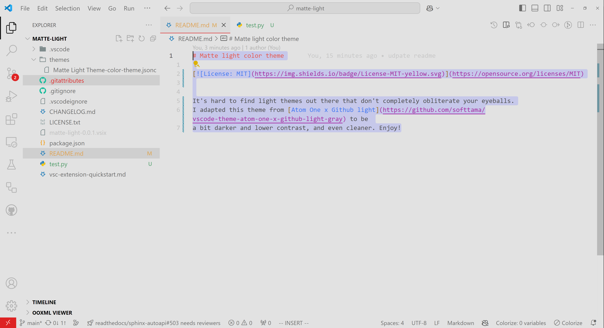

# Matte light color theme

It's hard to find light themes out there that don't completely obliterate your eyeballs.
[Atom One x Github light](https://github.com/softtama/vscode-theme-atom-one-x-github-light-gray) does a fantastic job of
taking the best from the Github light theme, but with Atom's wonderful syntax highlighting.
This theme adapted this idea further to be a bit darker and lower contrast, so it's even easier on the eyes. Enjoy!

